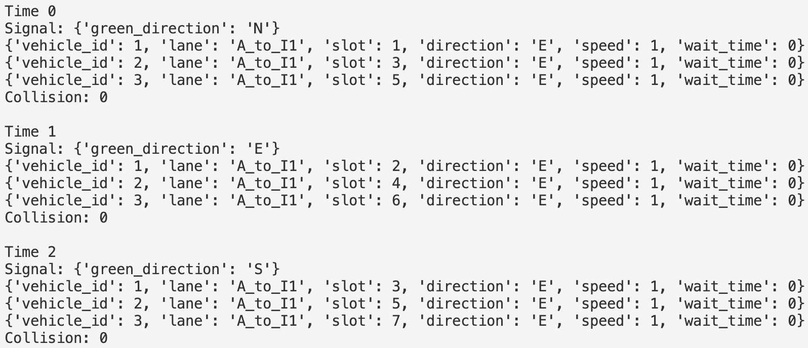

# ECEN 723 Spring 2026 Project Phase A Report

**Team ID:** 4  
**Group:** v-group

---

## 1. Introduction

In Phase A, each v-group is required to complete the software coding of the vehicle system in the road network described in the project overview. The code should be well tested and debugged. In this phase, the v-group may assume signal control behavior, while preparing a protocol for future integration with the paired i-group in Phase B.

The goal of our Phase A implementation is to simulate vehicle movement in the traffic system while satisfying the main project constraints. Each vehicle starts from node A, visits nodes B, C, and D in some order, and finally returns to A. During movement, vehicles should obey traffic signals, avoid collisions, and remain within legal driving directions defined by the system description. The project overview also specifies that vehicles move in discrete time steps, occupy slots on road segments, and must stop at a red light.

In this work, we implemented a simplified vehicle-side simulator in Python. Since Phase A allows the v-group to assume signal control, we used a mock round-robin traffic signal to test vehicle behaviors before integration with the i-group in Phase B.

---

## 2. System Architecture

Our Phase A v-group prototype is organized into the following modules:

### 2.1 Vehicle Model

This module defines the `Vehicle` class. Each vehicle stores:

- vehicle ID
- current node
- next node
- route
- direction
- lane
- slot position
- speed
- waiting time
- finished status

The vehicle route is generated as:

- start from A
- visit B, C, and D in random order
- return to A

This design allows multiple vehicles to follow different trip orders while using the same road model.

### 2.2 Route and Direction Module

This module determines the driving direction from the current node to the next destination node. The code assumes a simplified outer-ring topology:

- `A -> D -> C -> B -> A` for clockwise movement
- the reverse order for counterclockwise movement

For a given current node and next node, the vehicle chooses the shorter direction, with clockwise preferred in tie cases.

### 2.3 Decision Module

This is the main decision-making module of the v-group. At each timestep, a vehicle decides whether to move or stop based on:

- congestion level in the same lane
- whether the front slot is occupied
- whether the vehicle is at an intersection
- whether the current traffic signal allows crossing

This logic ensures that vehicles obey the assumed signal control and avoid unsafe movement.

### 2.4 Movement Module

This module updates the vehicle state after the decision is made.

- If the vehicle is not at the last slot of the lane and is allowed to move, it advances by one slot.
- If the vehicle is at the intersection entry slot and is allowed to move, it crosses the intersection, resets its slot to 0, and advances to the next route segment.

### 2.5 Safety Checker

This module checks the correctness of the simulation. In the current prototype, the following checks are included:

- collision detection
- illegal direction detection
- placeholder for U-turn detection

Collision is defined as more than one vehicle occupying the same lane and slot, which follows the project overview definition.

### 2.6 Simulation Driver

This module runs the full simulation over multiple timesteps. At each timestep, it:

1. generates the current signal
2. updates each vehicle decision
3. moves each vehicle
4. performs safety checking
5. prints the simulation results

---

## 3. Algorithm

### 3.1 Vehicle Routing

Each vehicle starts at node A and is assigned a route of the form:

`A -> {B, C, D in random order} -> A`

The intermediate destination order is randomized using Python `random.shuffle()`. For each route segment, the function `get_direction(current_node, next_node)` determines the next driving direction.

### 3.2 Decision Logic

The decision logic is implemented in the `decide()` function. The rules are:

1. If the vehicle has already finished its route, it stops.
2. If congestion ahead in the same lane is too high, the vehicle stops.
3. If another vehicle is directly in front of it, the vehicle stops.
4. If the vehicle is at the last slot before the intersection, it may cross only when its direction matches the current green signal.
5. Otherwise, it moves forward normally.

This algorithm is intentionally simple in Phase A, but it already captures the main vehicle-side behaviors required by the project.

### 3.3 Congestion and Blocking

To model basic traffic awareness, two helper functions are used:

- `front_blocked(v, vehicles)`: checks whether the next slot in the same lane is occupied
- `congestion_level(v, vehicles)`: counts how many vehicles are ahead in the same lane

If congestion is too high or the front slot is occupied, the vehicle does not move in that timestep.

### 3.4 Assumed Signal Control

Since the v-group can assume signal control in Phase A, we used a mock signal generator:

- the green direction rotates in the order `N -> E -> S -> W`

This simplified controller is enough for testing whether vehicles correctly obey the traffic light interface before Phase B integration.

---

## 4. Source Code

The implementation was developed in Python. The main code components are shown below.

### 4.1 Direction Selection

```python
def get_direction(current_node, next_node) -> str:
    if current_node == next_node:
        raise ValueError(f"current_node and next_node cannot be the same: {current_node}")

    cur_idx = NODES.index(current_node)
    next_idx = NODES.index(next_node)

    clockwise_steps = (next_idx - cur_idx) % len(NODES)
    counterclockwise_steps = (cur_idx - next_idx) % len(NODES)

    if clockwise_steps <= counterclockwise_steps:
        return CLOCKWISE_DIR[current_node]
    else:
        return COUNTERCLOCKWISE_DIR[current_node]
```

This function selects the driving direction for the next route segment.

### 4.2 Vehicle Decision Logic

```python
def decide(v, vehicles, signal):
    if v.finished:
        v.speed = 0
        return

    if congestion_level(v, vehicles) >= 3:
        v.speed = 0
        v.wait_time += 1
        return

    if front_blocked(v, vehicles):
        v.speed = 0
        v.wait_time += 1
        return

    if v.slot == NUM_SLOTS - 1:
        if v.direction == signal["green_direction"]:
            v.speed = 1
            v.wait_time = 0
        else:
            v.speed = 0
            v.wait_time += 1
        return

    v.speed = 1
    v.wait_time = 0
```

This function is the core of the v-group algorithm. It decides whether a vehicle should stop or move.

### 4.3 Vehicle Movement

```python
def move(v):
    if v.finished:
        return

    if v.speed == 1:
        if v.slot < NUM_SLOTS - 1:
            v.slot += 1
        else:
            v.slot = 0
            v.advance_route()
```

This function updates the vehicle position after a decision is made.

### 4.4 Collision Checking

```python
def check_collision(vehicles) -> int:
    seen = set()
    collisions = 0

    for v in vehicles:
        if v.finished:
            continue

        key = (v.lane, v.slot)
        if key in seen:
            collisions += 1
        seen.add(key)

    return collisions
```

This function checks whether multiple vehicles occupy the same lane and slot.

---

## 5. Code Test Cases

To test the Phase A implementation, we used a simple multi-vehicle scenario.

### Test Case 1: Three vehicles on the same starting road

Three vehicles are initialized at node A with different slot positions:

- Vehicle 1: start slot 0
- Vehicle 2: start slot 2
- Vehicle 3: start slot 4

This test checks:

- normal forward movement
- front blocking behavior
- congestion behavior
- obedience to traffic signals
- collision detection

The simulation runs for 30 timesteps.

---

## 6. Examples of Code Test Results

Below is an example of the simulation output format produced by the `run()` function.

### Example Output Snippet



### Discussion of Test Results

The test output shows that the vehicles move forward while maintaining safe separation within the same lane. No collisions are observed in the simulation, which indicates that the slot-based movement and blocking logic are functioning correctly.

When a vehicle reaches the intersection entry slot, it checks the current green direction before crossing. Vehicles only proceed when the signal matches their direction, ensuring that no red-light violations occur. This behavior confirms that the implementation correctly enforces traffic signal constraints.

In addition, the congestion and front-blocking mechanisms prevent vehicles from moving into occupied slots, further ensuring collision avoidance. The system maintains consistent and stable behavior across multiple timesteps.

Because the current Phase A implementation uses a mock signal controller and a simplified outer-ring road model, it is still a prototype. However, this design is sufficient for Phase A, as the requirement allows the v-group to assume signal control and focus on software implementation, testing, and protocol preparation for Phase B.

---

## 7. Protocol Preparation for Phase B

The project requirement states that the v-group and i-group of the same team need to talk with each other and build a protocol for information exchange, because the two codes will be integrated in Phase B.

Based on the current implementation, the v-group can provide the following vehicle information to the i-group:

- vehicle_id
- lane
- slot
- direction
- speed
- wait_time

This is already supported by the `to_dict()` function in the code.

Example:

```python
def to_dict(self) -> dict:
    return {
        "vehicle_id": self.vehicle_id,
        "lane": self.lane,
        "slot": self.slot,
        "direction": self.direction,
        "speed": self.speed,
        "wait_time": self.wait_time
    }
```

The v-group expects the i-group to return signal information such as:

- `green_direction`
- possibly red directions or crossing constraints in future versions

At the moment, the mock signal function uses the following format:

```python
def mock_signal(t) -> dict:
    return {
        "green_direction": DIRECTIONS[t % 4]
    }
```

This provides a simple and clear interface for future integration.

---

## 8. Conclusion

In this Phase A work, we developed a Python-based vehicle simulation prototype for the road system described in the project overview. The implementation includes vehicle modeling, route generation, decision logic, movement updates, safety checking, and simulation output.

The code was tested with multiple vehicles and produced collision-free execution in the example scenario. The current design also defines a basic information-exchange protocol that can be used for integration with the i-group in Phase B.

Overall, this Phase A prototype satisfies the main report requirements by describing the architecture and algorithm of the code, including representative source code, and presenting examples of code test results.
